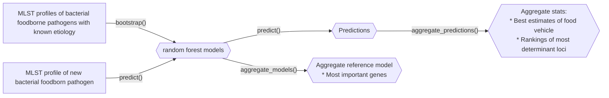

# source-attribution-MLST

This package implements the ideas from the source attributions project
in [Gu et al 2023](https://doi.org/10.1089/fpd.2023.0046).
Given a set of known bacterial foodborne pathogens and their MLST profile,
this package can predict the food sources of future bacterial foodborne
pathogen genomes.

1. Create a set of random forest models
2. Query your genome against the random forest models
3. Aggregate the predictions



## Installation

Requires R and `devtools`

```shell
library(devtools)
devtools::install_github("ncezid-biome/source-attribution-MLST")
```

To install the executable scripts, locate where they were installed,
e.g., `$HOME/R/4/3.2/sourcerer`, and update your `PATH`.
In Linux, it looks like this:

```shell
# Find the installation
find ~ -type d -name sourcerer
# => assume the path is $HOME/R/4/3.2/sourcerer for this example
export PATH=$PATH:$HOME/R/4/3.2/sourcerer/exec
# Double check the installation with the which command
which bootstrapRF.R
which predictRF.R

```

## Usage

First, create a model or models with `bootstrapping()` or  `Rscript bootstrapRF.R`.
Then, query the model with `prediction()` or `Rscript predictRF.R`.

Creating a model is done with a "bootstrap" because it represents only one
outcome out of all the stochatic outcomes in the random forest model.
Therefore, the usage is to create many models and then run prediction
on many models to get an aggregated outcome.

### Examples with API

```R
library("sourcerer")

reps    <- 10
my_seed <- 23 # leave blank for random seed
ncores  <- 1  # parallelization

# Random forest modeling step
rf_filenames <- bootstrapping(
                   input  = "tests/testthat/Listeria_isolates.csv.gz",
                   output = "results/",
                   ncores = ncores,
                   bootstrap_reps  = reps,
                   loci_start_with = "LMO",
                   my_seed = my_seed
                )


# Make predictions, one per model
predictions <- list()
for(i in (1:seq_along(rf_filenames))){
  predictions[[i]] <- prediction(
        model_filename = rf_filenames[[i]],
        query = "tests/testthat/example_query.csv", 
        ncores = ncores)
}

# Get a table of predictions
aggregate_predictions_table <- aggregate_predictions(
                                  predictions = predictions)

print(aggregate_predictions_table)

# Aggregate the models to find the most important genes
ref_model <- aggregate_model(rf_filenames)
print(head(ref_model$aggregate_rank))

```

